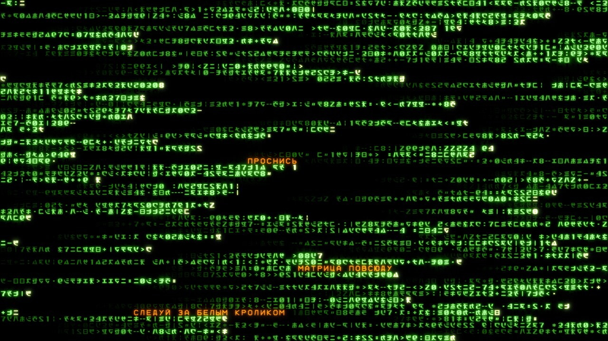
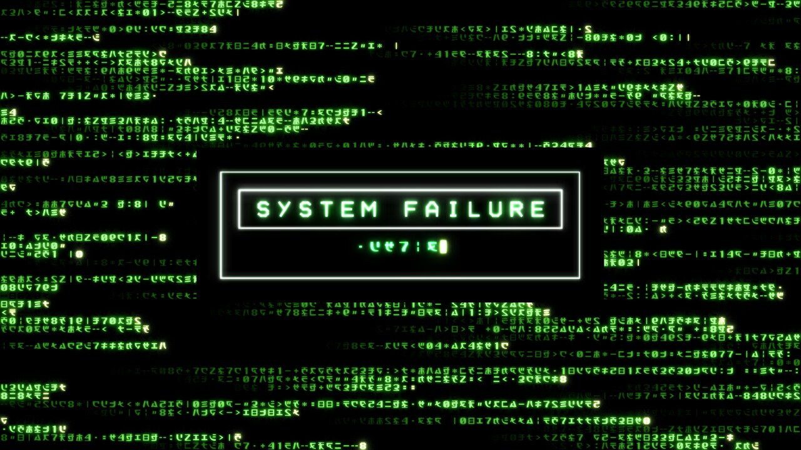

# matrix-rain-saver

**Матричный дождь как скринсейвер и полноценный локер экрана для X11 — с
русскими заголовками, которые дождь «расшифровывает» прямо на лету.**

[English version →](README.en.md) · [Установка и настройка →](docs/INSTALL.md) ·
[Архитектура →](ARCHITECTURE.md)


---

## Что это

Потоки кода текут **горизонтально, слева направо** — и по пути «прорисовывают»
заголовок: перед проявляющимся текстом бежит мерцающий матричный скрэмбл, осевшие
буквы остаются другим цветом. Кириллица — **собственная**, нарисованная в стиле
Matrix-Code: монолинейный штрих 123/1024 em, квадратные терминалы, срезы 45° вместо
кривых.

Рендер — порт GPGPU-пайплайна [Rezmason/matrix](https://github.com/Rezmason/matrix)
(дождь, bloom, палитра, MSDF-глифы) с WebGL/regl на Python + moderngl (OpenGL 3.3
core). Логика проявления текста вдохновлена
[meanwhile](https://github.com/tomdavenport/meanwhile).

Всё работает **без интернета**: ни один процесс проекта не ходит в сеть.

## Возможности

- **Единое пространство на всех мониторах.** Потоки дождя свободно пересекают
  границы экранов: каждый процесс-рендерер детерминированно считает симуляцию всего
  «мира» от общей базы времени и рисует только свой кроп. Мониторов может быть
  сколько угодно (RandR-автодетект), в том числе с разной ориентацией.
- **Заголовки из любой SQLite-базы.** Укажите файл и имена колонок — сейвер будет
  показывать свежие записи за последние N часов, перечитывая базу раз в час. Базы
  нет? Работает на встроенных фразах.
- **Настоящий локер** на базе [xsecurelock](https://github.com/google/xsecurelock):
  перехват ввода, устойчивость к падениям и проверка **системного пароля через
  PAM** — а вид наш: дождь во весь экран и диалог `SYSTEM FAILURE`.
- **Аккуратная типографика.** Длинные заголовки разбиваются на две сбалансированные
  строки по границе слова; фраза никогда не рвётся между мониторами и не появляется
  на ещё не прорисованном поле.
- **Bloom как в фильме** — highpass → пирамида размытий → композит; палитры
  (classic-green, amber, ice-blue, red или своя) и десятки параметров в одном
  прокомментированном TOML.
- **Свой шрифт можно перерисовать**: глифы заданы осевыми скелетами в обычном
  Python-файле, пересборка атласа — одна команда.

<table>
<tr>
<td width="50%"></td>
<td width="50%"></td>
</tr>
<tr>
<td align="center"><sub>Сейвер: фразы проявляются сквозь дождь</sub></td>
<td align="center"><sub>Локер: ввод пароля, дождь заморожен</sub></td>
</tr>
</table>

## Требования

| | |
|---|---|
| ОС | Linux + **X11** (любой WM; разрабатывалось на DWM). **Wayland не поддерживается** |
| GPU | OpenGL 3.3+ — подойдёт любой Mesa/NVIDIA этого десятилетия |
| Python | 3.11+ |
| Сборка | `cmake`, `g++`, `make`, `curl`, `git` — для msdfgen (генератор атласа) |
| Локер | `xsecurelock` + `xss-lock` из репозиториев дистрибутива |

## Установка

```sh
git clone https://github.com/HelpFreedom/matrix-rain-saver.git
cd matrix-rain-saver
./install.sh
```

`install.sh` идемпотентен и делает всё сам: создаёт venv на Python 3.11+, ставит
зависимости, собирает msdfgen, скачивает оригинальный матричный атлас и генерирует
объединённый атлас с кириллицей.

Подробности, включая ручную установку и автозапуск по простою, —
в [docs/INSTALL.md](docs/INSTALL.md).

## Запуск

```sh
# Скринсейвер на все мониторы; выход по любой клавише или движению мыши
.venv/bin/python -m matrixrain --standalone

# Одно окно с заданной геометрией (для отладки и подбора настроек)
.venv/bin/python -m matrixrain --geometry 1920x1080+0+0
```

### Локер

Разовая настройка:

```sh
sudo apt install xsecurelock xss-lock
sudo install -m 644 xsecurelock/pam.d/xsecurelock /etc/pam.d/xsecurelock
```

Использование:

```sh
bin/matrix-lock            # заблокировать сейчас
bin/matrix-lock --daemon   # покажет команду xss-lock для автоблокировки по простою
```

Пока экран заблокирован, идёт дождь. **Окно ввода пароля появляется, как только вы
начинаете печатать пароль** — первая же нажатая буква или цифра открывает диалог и
становится первым символом пароля. Движение мыши диалог не открывает (дождь просто
продолжается), `Esc` закрывает уже открытый диалог. Пока диалог открыт, дождь на
всех мониторах замирает.

<details>
<summary>Почему именно так, а не «по Esc»</summary>

xsecurelock запускает auth-модуль на **любой** ввод, но передаёт ему разбудившую
клавишу только если она **печатная**. Это его собственная защита (файл
`auth_child.c`, функция `ContainsNonControl`): управляющие клавиши, включая `Esc`,
отбрасываются всегда, а движение мыши вообще не даёт символов. Поэтому «открывать
окно по Esc» на xsecurelock технически невозможно — этот `Esc` до модуля не доходит.
Открытие по первой печатной клавише работает надёжно и заодно не теряет первый
символ пароля.
</details>

Разблокировка — вашим **системным паролем**: проверку выполняет штатный
`authproto_pam`, наш код к паролю не прикасается (и обнуляет буфер после
использования). Неверный пароль — красная вспышка рамки.

## Источник заголовков

По умолчанию (`[feed] db = ""`) базы нет и показываются встроенные фразы — проект
работает сразу после установки. Чтобы показывать свои записи, укажите **любую**
SQLite-базу с колонкой заголовка и колонкой времени:

```toml
[feed]
db = "~/.local/share/matrix-rain/headlines.db"
db_table = "posts"
db_title_column = "title"
db_time_column = "created_at"
window_hours = 20        # берём записи за последние 20 часов
refresh_seconds = 3600   # перечитываем раз в час
```

Файл открывается **только на чтение** и никогда не изменяется. Строки с пустым
временем игнорируются, дубликаты схлопываются, мусор отсеивается регэкспами
`exclude`. Никакой базы в комплекте нет — источник данных полностью ваш.

## Настройка

Все параметры с комментариями — в [config/default.toml](config/default.toml):
палитры, скорость и плотность дождя, размер глифов, тайминги проявления текста,
bloom, поведение локера, а также переопределения для отдельных мониторов.

Скопируйте файл и правьте только нужные ключи:

```sh
mkdir -p ~/.config/matrix-rain
cp config/default.toml ~/.config/matrix-rain/config.toml
```

Порядок применения: встроенные значения → ваш файл → секция `[monitor.<имя>]` →
флаги командной строки.

## Свой шрифт

Глифы заданы осевыми ломаными в [atlas/skeletons.py](atlas/skeletons.py) —
это обычные координаты в единичном квадрате. После правки:

```sh
.venv/bin/python atlas/build_atlas.py            # пересобрать атлас
.venv/bin/python atlas/preview.py "ПРИВЕТ"       # быстрый просмотр без GL
```

> Забавный факт: в оригинальном наборе Matrix-Code нет цифры 6 — в нашем текстовом
> наборе она есть.

## Ограничения

- **Wayland не поддерживается** — проект целиком построен на X11 (RandR,
  override-redirect окна, GLX). Портирование потребовало бы отдельного оконного слоя.
- **Переключение на другой TTY** (`Ctrl+Alt+F2`) — общая особенность всех
  X11-локеров: сам локер его не блокирует. Доступа к вашей разблокированной сессии
  это не даёт (на других TTY требуется вход), но если нужен полный запрет —
  включите `DontVTSwitch` в конфигурации Xorg.
- Абсолютно «непреодолимого» локера в user-space не существует: пользователь с
  root-правами на машине может всё. Это верно для любого экранного локера.
- Автоматических тестов в репозитории нет — проверки выполнялись вручную.

## Как это устроено

Подробный разбор архитектуры — [ARCHITECTURE.md](ARCHITECTURE.md): фрейм-граф
рендера и все шейдеры, синхронизация процессов через flock и файловые флаги,
протокол общения с PAM, генерация MSDF-атласа, и почему диалог локера рисуется
дочерним окном saver'а (спойлер: композитор).

## Лицензия

[GNU General Public License v3.0 или новее](LICENSE).

Проект содержит порты MIT-лицензированного кода
([Rezmason/matrix](https://github.com/Rezmason/matrix),
[meanwhile](https://github.com/tomdavenport/meanwhile)) — их копирайты сохранены
в [NOTICE](NOTICE), как того требует MIT.

Оригинальный матричный MSDF-атлас **не хранится** в репозитории: его скачивает
`atlas/fetch_assets.sh` при установке. Начертания матричных глифов восстановлены
сообществом из промо-материалов франшизы — учитывайте это при коммерческом
использовании.

## Авторы

- **Black Triangle** ([@HelpFreedom](https://github.com/HelpFreedom)) — автор и
  владелец проекта: постановка задачи, направление, дизайн-решения, приёмка.
- **Claude** (Anthropic) — реализация: порт рендер-пайплайна, оконный слой,
  генератор кириллического атласа, локер и документация.
